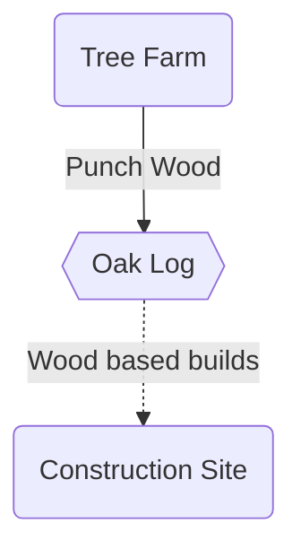
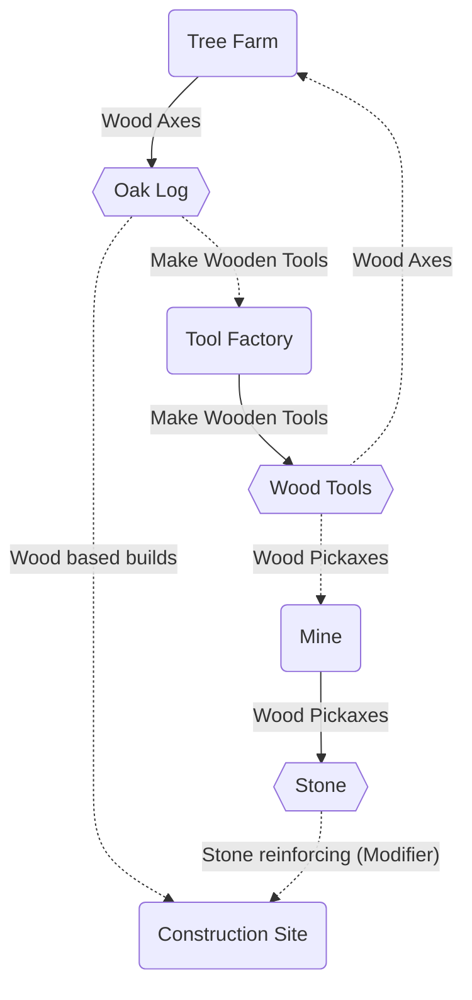
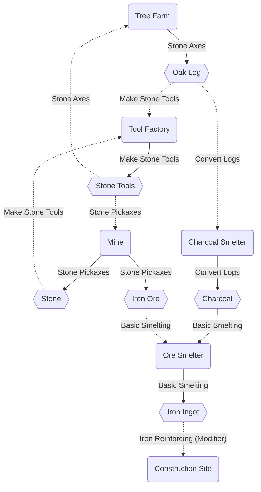
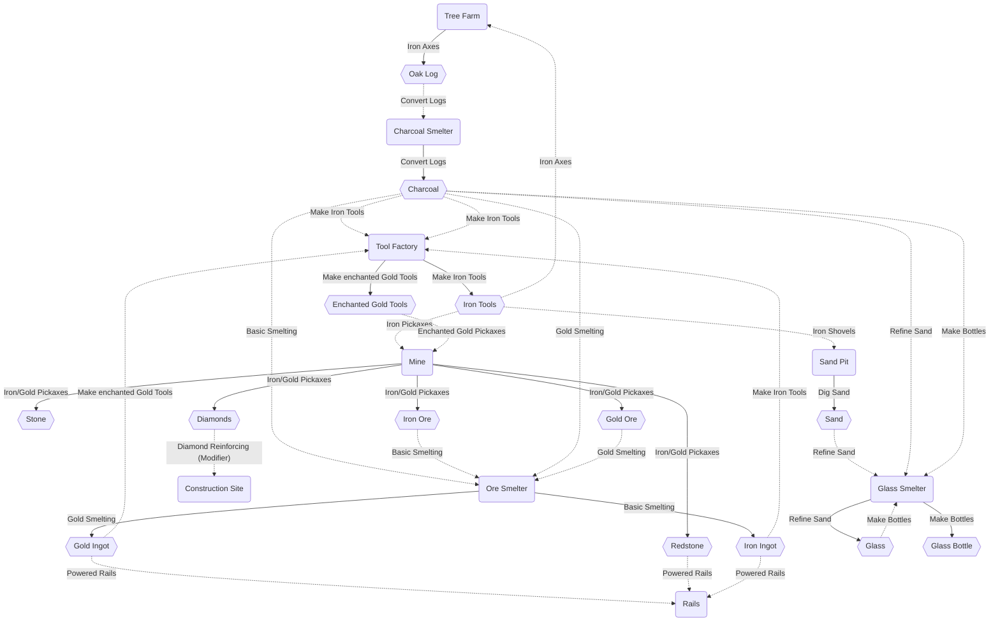

# CivVictoria3
Victoria 3 Total Conversion Mod into CivMC

## Planned Buildings Roadmap

# Dirt tier
All buildings are built by the **Construction Site**

# Wood tier

# Stone tier

# Iron Tier

